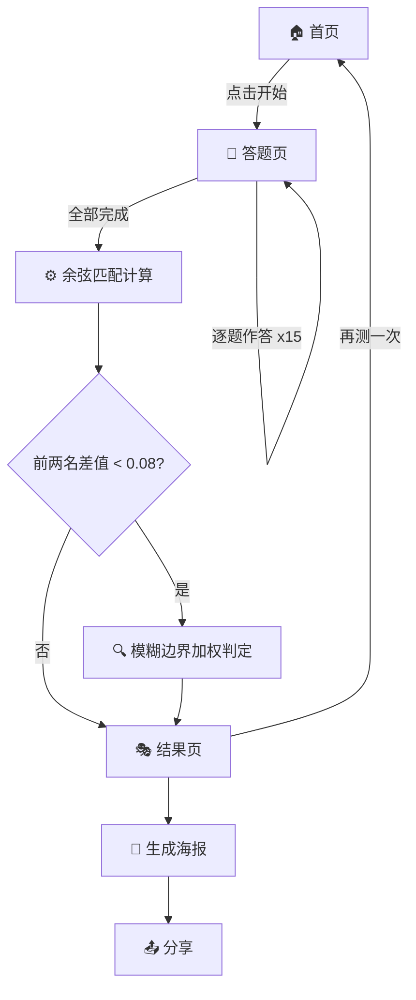

## 0. 文档概览

| 项目代号 | MyGObti |
| --- | --- |
| 定位 | 基于《BanG Dream! It's MyGO!!!!!》角色特质的恶搞人格测试 H5 应用 |
| 核心机制 | 3 轴自定义维度 × 15 道情境多选题 × 余弦相似度匹配 → 角色结果页 → 海报分享 |
| Phase 1（MVP） | 评分引擎 + 匹配算法 + 结果页 + 基础题库 → **可玩可分享的最小闭环** |
| Phase 2（内容深化） | 用深度搜索提示词批量采集角色 Meme/梗 + 剧情场景，替换通用题目与文案 |

<aside>
🎯

**Phase 1 目标**：先把「答题 → 算分 → 出结果 → 分享」的完整链路跑通，用最小内容量验证机制。

**Phase 2 目标**：用 2 个深度搜索提示词系统性采集 MyGO 角色梗/名场面，让题目和文案从「通用情境」升级为「粉丝会心一笑的剧情还原」。

</aside>

---

# Phase 1：MVP 核心实现

> 目标：纯前端实现从答题到结果的完整闭环，零后端依赖。
> 

---

## 1.1 角色列表与锚点坐标

以下 8 个角色各占一个三维象限，坐标归一化到 [-1, 1]：

| 角色 | 称号 | 情感表达 | 社交策略 | 自我认知 | 定位说明 |
| --- | --- | --- | --- | --- | --- |
| **高松灯** | 纯爱战神·沉重自闭少女 | -0.9 | -0.8 | -0.7 | 极度内敛、回避、迷茫 |
| **千早爱音** | 虚荣溜溜球·七秒记忆逃兵 | +0.3 | -0.7 | -0.4 | 表面外放、核心逃避、自我模糊 |
| **要乐奈** | 抹茶芭菲真理教主·自由野猫 | -0.2 | -0.3 | +0.8 | 情感中性、略回避、非常清醒 |
| **长崎爽世** | 精于算计的控制狂母亲 | -0.1 | +0.8 | +0.7 | 克制表达、强控制、高度清醒 |
| **椎名立希** | 正义狂犬·暴走人形炸弹 | +0.9 | +0.3 | +0.6 | 极度外放、略主动、有主张 |
| **三角初华** | 热血笨蛋·善良推土机 | +0.7 | +0.8 | -0.3 | 外放热血、强行介入、不太清醒 |
| **若叶睦** | 透明人·专业和事佬植物人 | -0.7 | +0.2 | -0.6 | 内敛、被动跟随、自我认知低 |
| **丰川祥子** *(隐藏)* | 破碎的高自尊客服小妹 | -0.4 | +0.5 | +0.9 | 压抑但有服务意识、极度清醒 |

<aside>
⚠️

以上坐标为初始估值，**必须找 3-5 个深度粉丝做独立标注校准**，取均值后确定最终锚点。

</aside>

---

## 1.2 维度模型：3 条自定义轴线

从 MyGO 角色群的核心冲突出发提炼，3 轴 → 2³ = 8 个象限，恰好覆盖 8 个角色：

| 轴线 | 低分端 | 高分端 | 区分目标 |
| --- | --- | --- | --- |
| **情感表达** | 内敛压抑（灯、睦） | 外放爆发（立希、初华） | 拉开"闷"与"炸"的角色 |
| **社交策略** | 回避/逃离（爱音、灯） | 主动介入/控制（爽世、初华） | 拉开"逃兵"与"推土机" |
| **自我认知** | 迷茫/被动（灯、睦） | 清醒/有主张（乐奈、爽世） | 拉开"透明人"与"计算型" |

---

## 1.3 题目设计策略

### 题型：多选情境 + 加权向量

每题 4 个选项，每个选项是一个 `[情感表达, 社交策略, 自我认知]` 的向量增量：

```json
{
  "question": "乐队排练迟到了30分钟，你的第一反应是？",
  "options": [
    { "text": "默默等着，反正说了也没用", "delta": [-0.5, -0.3, -0.2] },
    { "text": "直接开骂，迟到就是不尊重大家", "delta": [+0.6, +0.4, +0.3] },
    { "text": "无所谓，先去买杯抹茶芭菲", "delta": [0.0, -0.2, +0.5] },
    { "text": "打电话确认安全，然后温柔提醒", "delta": [+0.2, +0.5, +0.1] }
  ]
}
```

### 题量规划

- 每轴至少 4 题保证信度 → 3 轴 × 4 = **12 题下限**
- 加 2-3 道干扰/趣味题（不计分但增加沉浸感） → **总共 15 题**
- 用户体验 2-3 分钟完成

<aside>
💡

Phase 1 先用**通用情境题**跑通流程，Phase 2 再用深度搜索采集的 MyGO 剧情场景**批量替换题目**。

</aside>

---

## 1.4 匹配算法

### 核心：余弦相似度

```tsx
function cosineSimilarity(a: number[], b: number[]): number {
  const dot = a.reduce((sum, v, i) => sum + v * b[i], 0)
  const magA = Math.sqrt(a.reduce((sum, v) => sum + v * v, 0))
  const magB = Math.sqrt(b.reduce((sum, v) => sum + v * v, 0))
  return dot / (magA * magB)
}

function match(userVector: number[], characters: CharacterProfile[]) {
  return characters
    .map(c => ({
      name: c.name,
      score: cosineSimilarity(userVector, c.anchor),
    }))
    .sort((a, b) => b.score - a.score)
}
```

**为什么用余弦而非欧氏距离？** 用户答题"力度"不同，余弦只看方向不看模长，更稳定。

### 防"测不准"修正

1. **模糊边界**：前两名相似度差 < 0.08 时，找差异最大轴加权判定
2. **隐藏角色（丰川祥子）**：独立 flag 触发——同时满足「自尊心极高 + 服务意识强 + 被抛弃感」时触发，不走坐标匹配

---

## 1.5 结果页展示

结果页需同时展示：

1. **角色匹配卡**：角色名 + 称号 + 海报图
2. **维度可视化**：用户得分 vs 角色标准分对比（雷达图）
3. **毒舌锐评**：角色专属吐槽文案（Phase 1 用固定文案，Phase 2 替换为采集的梗）
4. **灵魂金句**：角色经典台词
5. **羁绊信息**：天敌 + 灵魂绑定 + 全网占比（前端伪随机）
6. **分享海报**：暗色系卡片 + 角色剪影 + 维度图 + 金句

---

## 1.6 用户旅程



---

## 1.7 UI/UX 设计要点

<aside>
🎨

**核心风格**：病娇暗系 · 聊天界面感 · 手写涂鸦质感

</aside>

- **配色**：深灰/墨蓝底 + 霓虹紫/粉高光 + 手写体标题
- **答题界面**：模拟 LINE 群聊气泡，题目像群里发生的突发事件
- **过渡动画**：选项选中后像消息发送飞出，新题目像新消息弹入
- **弹幕特效**：出结果前 2 秒，屏幕闪过 MyGO 经典台词弹幕
- **结果海报**：暗色系卡片 + 角色剪影 + 维度图 + 金句

---

## 1.8 社交裂变功能

- **「你的天选克星」**：结果页展示天敌角色，引导转发
- **「MyGO 乐队匹配」**：5 人组队凑齐一支乐队解锁隐藏内容
- **「全网统计」**：前端模拟各角色占比数据

---

## 1.9 技术实现复杂度

| 模块 | 复杂度 | 实现方案 |
| --- | --- | --- |
| 维度计算 | ⭐ | 纯前端，答一题加一次向量 |
| 余弦匹配 | ⭐ | 10 行 JS |
| 题库存储 | ⭐ | JSON 文件直接打包 |
| 角色坐标校准 | ⭐⭐ | 人工标注 + 测试校准 |
| 模糊边界处理 | ⭐⭐ | 前端条件判断 |
| 隐藏角色触发 | ⭐ | flag 计数器 |
| 雷达图可视化 | ⭐⭐ | Chart.js / ECharts |

<aside>
✅

**Phase 1 整个评分引擎纯前端实现，零 API 调用。**

</aside>

---

## 1.10 校准流程

1. **定轴线** → 3-5 个深度粉丝独立给 8 角色 3 维度打分（-10 到 +10），取均值
2. **写 15 道通用情境题** → 每题 4 选项，手动标注 delta 向量
3. **内测** → 10-20 个粉丝测试，统计满意率
4. **微调** → 调整 delta 权重或角色锚点
5. **上线** → 前 500 份数据后再做一轮校准

---

## 1.11 注意事项 & 风控

- [ ]  **免责声明**：首页和结果页均标注「本测试纯属 AI 发疯与刻板印象缝合，毫无科学依据，请勿当作心理诊断」
- [ ]  **内容红线**：所有文案只做「向下的自嘲式幽默」，不涉及性别对立、疾病歧视、真实人身攻击
- [ ]  **无登录墙**：点开即测，不收集手机号/邮箱
- [ ]  **隐藏角色触发**：丰川祥子的具体 flag 条件在校准后确定

---

# Phase 2：深度内容采集与题库升级

> 目标：用 2 个深度搜索提示词系统性采集 MyGO 角色 Meme、经典梗、名场面，将 Phase 1 的通用情境题和固定文案升级为**粉丝向剧情还原**。
> 

---

## 2.1 深度搜索提示词 A：角色 Meme & 梗百科采集

<aside>
🔍

**用途**：喂给 LLM / 搜索 Agent，批量采集每个角色的标志性 Meme、口头禅、粉丝二创梗、经典名场面台词，作为结果页「毒舌锐评」和「灵魂金句」的素材库。

</aside>

```
你是一个深度研究《BanG Dream! It's MyGO!!!!!》的二次元文化采集专家。

请针对以下 8 个角色，逐一完成信息采集：
高松灯、千早爱音、要乐奈、长崎爽世、椎名立希、三角初华、若叶睦、丰川祥子

对每个角色，请搜索并整理以下内容：

1. **口头禅 / 标志性台词**（至少 3 句）
   - 原文日语 + 中文翻译
   - 出自哪一集/哪个场景
   - 粉丝圈常用的变体或恶搞版本

2. **经典 Meme / 名场面**（至少 3 个）
   - 场景描述（发生了什么）
   - 为什么成为 Meme（粉丝如何解读/玩梗）
   - 常见的图片/表情包描述

3. **粉丝社区高频梗 / 二创梗**（至少 3 个）
   - 梗的内容和起源
   - 在 B站/推特/NGA 等社区的传播形式
   - 可以直接用在测试文案里的「一句话版本」

4. **角色人际关系梗**
   - 和其他角色之间的经典互动/冲突/名场面
   - 粉丝给这对关系起的 CP 名或关系绰号
   - 可以用来做「天敌」「灵魂绑定」配对的素材

5. **性格标签云**
   - 用 10-15 个短语概括这个角色在粉丝心中的刻板印象
   - 格式：「#标签1 #标签2 #标签3 ...」

输出格式：按角色分块，每个角色用 Markdown 二级标题，内容用编号列表。
优先采集中文社区（B站、NGA、贴吧、小红书）的梗，其次日文推特和英文 Reddit。
如果某个角色的梗较少，标注「素材不足，建议人工补充」。
```

---

## 2.2 深度搜索提示词 B：MyGO 剧情场景题库生成

<aside>
🔍

**用途**：喂给 LLM / 搜索 Agent，基于 MyGO 动画的实际剧情冲突点，生成可直接替换 Phase 1 通用题目的**剧情还原式情境题**，让粉丝在答题时有「这不就是那集的场景吗」的代入感。

</aside>

```
你是一个熟悉《BanG Dream! It's MyGO!!!!!》全部剧情的题目设计师。

## 背景
我正在做一个 MyGO 角色人格测试，使用 3 条评分轴线：
- **情感表达**：内敛压抑（-1）↔ 外放爆发（+1）
- **社交策略**：回避逃离（-1）↔ 主动介入/控制（+1）
- **自我认知**：迷茫被动（-1）↔ 清醒有主张（+1）

## 任务
请从 MyGO 动画中筛选 **15-20 个关键剧情冲突点**，将每个冲突点改编为一道情境选择题。

### 每道题的要求：
1. **题干**：用 1-2 句话描述一个**从动画真实剧情改编**的情境
   - 不要直接说「第X集灯做了什么」，而是把场景泛化为「你遇到了类似情况」
   - 但要保留足够的剧情细节让粉丝能认出「这是哪个场景」
   - 风格：像 LINE 群聊里朋友在问你「诶你遇到这种事会怎么办」

2. **4 个选项**：每个选项对应不同角色的典型反应方式
   - 选项文字要有趣、有梗，不要干巴巴的
   - 每个选项标注 delta 向量：[情感表达, 社交策略, 自我认知]
   - 向量值范围 -1.0 到 +1.0，精确到一位小数

3. **元数据**：
   - 标注原始剧情出处（第几集/什么事件）
   - 标注这道题主要测试哪条轴线
   - 标注难度（粉丝辨识度：高/中/低）

### 选题覆盖要求：
- 每条轴线至少有 5 道题作为主测轴
- 至少 3 道题涉及「乐队解散/重组」相关剧情
- 至少 2 道题涉及「演出/Live 现场」场景
- 至少 2 道题涉及「日常相处」轻松场景（做平衡用）
- 至少 1 道题专门用于触发隐藏角色丰川祥子（埋 flag）

### 输出格式：
```

[

{

"id": 1,

"question": "题干文字",

"source": "第X集·事件名",

"primaryAxis": "情感表达|社交策略|自我认知",

"fanRecognition": "高|中|低",

"options": [

{ "text": "选项A", "delta": [0.0, 0.0, 0.0], "archetype": "像XX的反应" },

{ "text": "选项B", "delta": [0.0, 0.0, 0.0], "archetype": "像XX的反应" },

{ "text": "选项C", "delta": [0.0, 0.0, 0.0], "archetype": "像XX的反应" },

{ "text": "选项D", "delta": [0.0, 0.0, 0.0], "archetype": "像XX的反应" }

],

"hiddenFlag": null

}

]

```

请确保题目之间不重复测同一个场景，选项风格统一且有趣。
```

---

## 2.3 Phase 2 执行计划

| 步骤 | 动作 | 产出 |
| --- | --- | --- |
| ① | 运行提示词 A，采集 8 角色 Meme 素材库 | 角色梗百科文档 |
| ② | 人工筛选：每角色精选 3 句金句 + 3 条毒舌文案 | 结果页文案 JSON |
| ③ | 运行提示词 B，生成 15-20 道剧情场景题 | 题库 JSON 初稿 |
| ④ | 人工校准：检查 delta 向量合理性 + 粉丝辨识度 | 题库 JSON 终稿 |
| ⑤ | 替换 Phase 1 的通用题目和固定文案 | 上线 V2 版本 |

---

# 进阶功能规划（V3）

- **AI 动态评语**：接入 LLM 根据答题倾向生成千人千面毒舌评语，替代固定文案
- **题目随机与去重**：题库扩展后每次随机抽题，保证各维度覆盖均匀
- **排序题**：V3 引入「按倾向排列 ABCD」题型，提升测量精度
- **第 4 轴扩展**：加入「规则感（自由散漫 ↔ 责任/秩序驱动）」轴线，4 轴 16 象限覆盖更多角色变体

